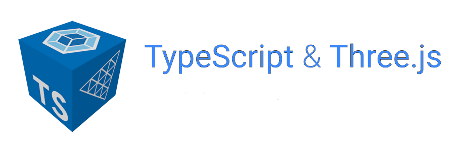
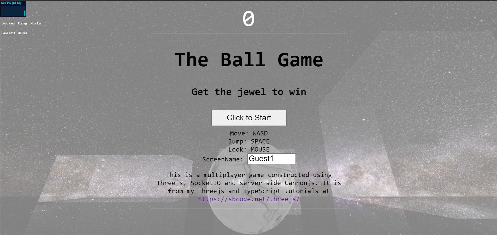
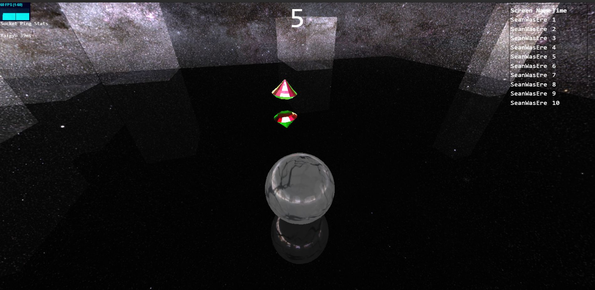

# Three.js and TypeScript: Ball game

_August 2021_

> 🔨 Learn Threejs, TypeScript and NodeJS to create interactive 3D content on the web. From Udemy [Three.js and TypeScript - Sean Bradley](https://www.udemy.com/course/threejs-tutorials/).

---

<h1 align="center">
    
</h1>





## Test localy

Clone, then:

```batch
npm install

npm run dev
```

Then visit [localhost:8080](localhost:8080).
